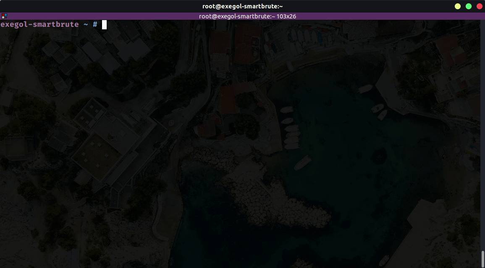
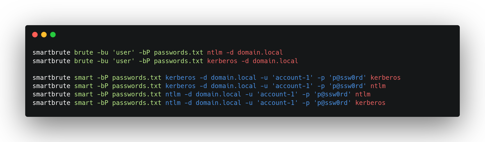
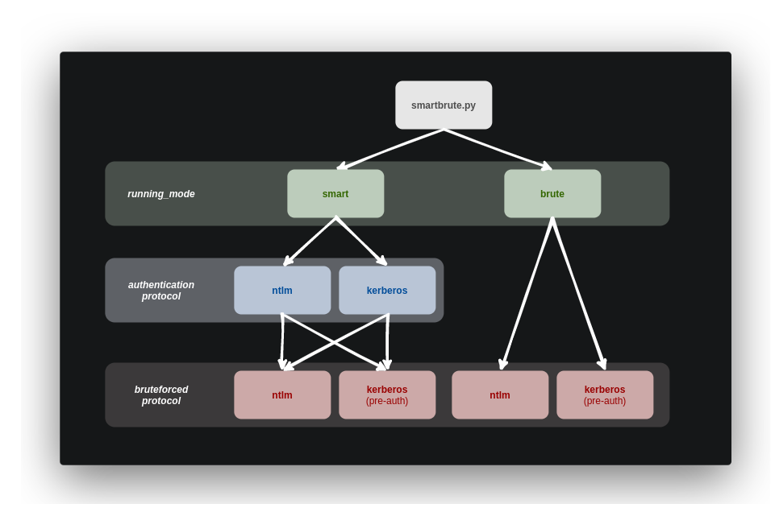
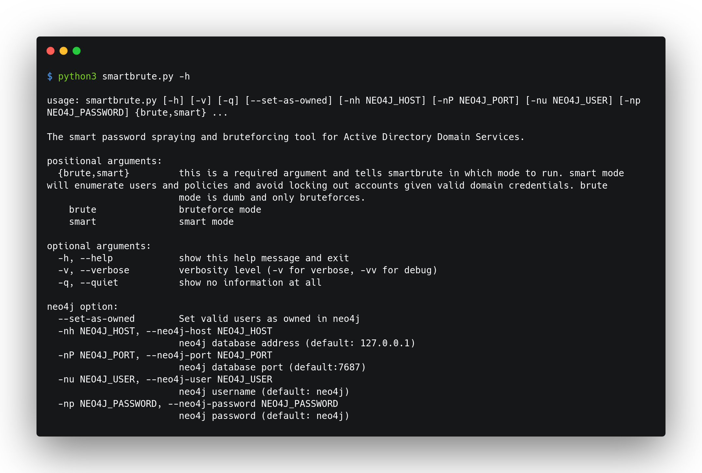

<!---->

# Description

##  Kann mittels BruteForce zum Durchsprühen von Anmeldeinformationen für Active Directory-Konten verwendet werden.

**:warning: Dieses Projekt ist noch nicht abgeschlossen. Im Moment macht die Programmierung es eher zu einem PoC, als zu einem stabilen Tool. 
Zumindest ist hier alles vorhanden, um mit Bruteforce an jedem Protokoll arbeiten zu können. 

## Core features - Kurz aufgelistet

### Jeder Methode hat seine eigenen Vorteile. Uns stehen dabei folgende Möglichkeiten zur Verfügung.

> Diese Methode testet die gefunden Accounts, auf gültige lokale Administratorrechte.
- NTLM über SMB:
- NTLM über LDAP

> Diese Methode ist der schnellste und best getarnteste Weg.
- Kerberos pre-authentication:
     + Dabei kann zwischen UDP oder TCP als Transportprotokoll gewählt werden.
     + Als Typ steht RC4, AES128, AES256 zur Verfügung.

     > UDP & RC4 sind dabei die schnellsten Arten. 
     > UDP wirft manchmal klarerweise Fehler aus.
     > Der Vorteil von AES128 und AES256 

Passwords are not the only secrets that can be bruteforced with this tool.
- When bruteforcing on NTLM: NT hashes can be attempted.
- When bruteforcing on Kerberos: RC4 keys (i.e. NT hashes) can be attempted.

When valid accounts are found:
- they can be set as owned in a neo4j database (used by BloodHound)
- when using neo4j, owned users that are on a path to Domain Admins will be highlighted

This tool can be used in two different modes for different scenarios: `smart` or `brute`.

### Smart mode

This mode can be used to make sure NOT to lock any account when bruteforcing by:
- Fetching the enabled users from Active Directory
- Fetching bad password count for each user
- Fetching lockout policies (global policy and granular policies set in Password Settings Objects). _Nota bene: PSOs can be applied to groups, the tool recursively lists all members from those groups and sets the appropriate lockout threshold for each user._
- Bruteforcing users according to the information found (i.e. keep the bad password count below the lockout threshold. A safety margin can be set).
  
In order for the first LDAP enumeration to occur, this mode requires knowledge of a low-priv user credentials. The following authentications are supported:
- **(NTLM)** Cleartext password
- **(NTLM)** [Pass-the-hash](https://www.thehacker.recipes/active-directory-domain-services/movement/lm-and-ntlm/pass-the-hash)
- **(Kerberos)** Cleartext password
- **(Kerberos)** [Pass-the-key](https://www.thehacker.recipes/active-directory-domain-services/movement/kerberos/pass-the-key) / [Overpass-the-hash](https://www.thehacker.recipes/active-directory-domain-services/movement/kerberos/overpass-the-hash)
- **(Kerberos)** [Pass-the-cache](https://www.thehacker.recipes/active-directory-domain-services/movement/kerberos/pass-the-cache) (type of [Pass-the-ticket](https://www.thehacker.recipes/active-directory-domain-services/movement/kerberos/pass-the-ticket))

Before bruteforcing anything, this mode also recursively fetches the members of special groups (Administrators, Domain Admins, Entreprise Key Admins, and many more).
When valid credentials are found, if the account is part of those members, it will be highlighted.

In smart mode, bruteforce can also be skipped to only show fetched users or password policies.

    
### Brute mode

The `brute` mode doesn't require prior knowledge of a low-priv user credentials but doesn't have safety features like the `smart` mode. This mode CAN effectively lock accounts.
In this mode, a username (or list of usernames) has to be supplied.
- Bruteforce can be operated line per line when supplying lists for both usernames and passwords/hashes
- On the first successful bruteforced authentication, the tool will recursively fetch (using LDAP) the members of special groups (Administrators, Domain Admins, Entreprise Key Admins, and many more). When valid credentials are found, if the account is part of those members, it will be highlighted.
- Bruteforce can be stopped when a valid account is found 

## Usage

This tool is designed to give its users the most control over what is happening. This leads to a complex (not complicated, there's a difference) usage.
This tool is built around multiple subparsers allocated in the following manner (cf. following graph and picture).

## Contributing

Pull requests are welcome. Feel free to open an issue if you want to add other features.

## Credits & thanks

This tool as well as its code was inspired/based on:
- [impacket](https://github.com/SecureAuthCorp/impacket)
- [sprayhound](https://github.com/Hackndo/sprayhound)
- [crackmapexec](https://github.com/byt3bl33d3r/CrackMapExec)
- [kerbrute](https://github.com/ropnop/kerbrute) and [pykerbrute](https://github.com/3gstudent/pyKerbrute)
- and probably indirectly many more

We thank all contributors behind those projects.

## Memes

And now, here is a collection of memes that perfectly frames this tool's spirit (feel free to contribute) 

  
  
  
  
  

